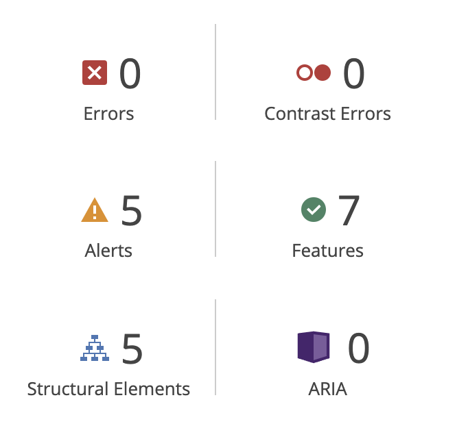
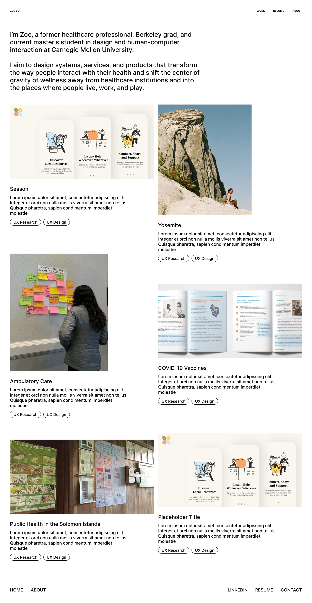

<mark>**Note that this document order from FP4 -> FP1**</mark>

<mark>Please sign up for the study</mark> at [https://tinyurl.com/pui-study](https://tinyurl.com/pui-study) to allow us to use your submission to create a better GenAI assistant for designers!

---

# **FP4 \- Final Project Writeup**

Feel free to refer to this [Markdown Cheat Sheet](https://www.markdownguide.org/cheat-sheet/) to make your writeup more organized, and you can preview your markdown file in VSCode [Markdown editing with Visual Studio Code](https://code.visualstudio.com/docs/languages/markdown#_markdown-preview). 

## Part 1: Website Description

This website is my personal portfolio, where I showcase the different projects I've worked on, both in school and in my professional career. The purpose of my website is to show recruiters who I am, what I'm passionate about, and a little bit of my personality. Since I am aiming to apply for service design roles in healthcare, I want my audience to see me as a professional, yet personable designer, whose best qualities are my ability to empathize and design human-centered experiences. Because of this, I didn't want the interactions on my website to be too over-the-board. However, I still wanted to showcase my front-end development skills, so incorporated a practical and functional filtering mechanism for recruiters to narrow down my projects based on what they're looking for, as well as subtle micro-interactions on hover and scroll. I think my website is interesting and engaging because it uses hierarchy, micro-interactions, and interactivity (in the filter function) primarily as a ***tool*** to get my message across--that I am passionate about the work that I do. I want people to *read* what I have to say and learn more about me and the work that I do. 

I also believe that the aesthetic of my website differentiates me from other more minimalist portfolios, and I hope that tells viewers that I am unafraid to take risks and explore.

## Part 2: User Interaction

1. **Filter projects:** on the homepage, click on any of the category tags under the projects to filter projects by that tag. Feel free to experiment with clicking multiple tags and removing them in any order by clicking them again, or clicking the row of selected tags at the top.
2. **Learn more about my "Season" project:** Click anywhere (except the tags) on the "Season" project card on the homepage to navigate to that page and learn more about the project.
3. **Learn more about me:** Click on any of the links in the navigation bar or footer to navigate to different pages (Work/Homepage, Resume, About Me) or external links to email me or add me on LinkedIn. 
4. **Experience the subtle micro-interactions:** Load each page to experience the micro-interactions triggered on scroll, or on hover (for links and buttons). May have to refresh the page.
5. **Responsiveness:** The website is responsive across 6 breakpoints, including for desktop and mobile screens. I have so many breakpoints because the formatting looked different based on each page, and I wanted them to be responsive to different sizes of desktop screens while maintaining the visual appeal. Because my project page and About Me pages have unconventional layouts (multiple columns, alignments, etc.) it was important for me to be very specific about the different breakpoints. Please interact with the site on a full-screen desktop and mobile. 
6. **Accessibility:** The website is accessible and has passed the WAVE test:
    * Homepage: 

## Part 3: External Tool

1. jQuery
    *  Rationale: I looked up multiple ways to use a filter function, and found libraries that would do it for me. I chose jQuery because I found a resource online (https://codepen.io/NKroe/pen/oRjbmr) using jQuery that seemed understandable to me (and less intimidating than React) and wanted practice using a library more "from scratch" while also simplifying my code.
    * Use: I used jQuery to implement the filter function by selecting elements dynamically and binding click events to filter options (e.g., with .on()). The function then toggles visibility of content based on whether they're "selected" (which uses .addClass and .removeClass from jQuery).
    * Benefit: It allowed me to create my filter function in an easier, more understandable way to me. If I didn't use it, I would have had to do more manual manipulations to my code.
2. ScrollReveal
    * Rationale: ScrollReveal provided an easy way (just one line of code, basically) for me to add the appear-on-scroll micro-interactions to my pages. I used it because I wanted to add a subtle fade-in effect to specific classes on my website and this was an easy way to do that.
    * Use: I linked to the library in my header, added a function in my JS script to call the "appear on scroll" function to all of the elements I gave the class "scroll".
    * Benefit: I was able to add a subtle, yet effective micro-interactions, which makes my website more engaging and dynamic to viewers without overwhelming them. 

## Part 4: Design Iteration

I ultimately decided not to do the background change on hover effect on my homepage, because I thought it would be too overwhelming to the user--this was also feedback that I had originally received in one of my critiques, but wasn't sure what I was going to do at that point. I also did not plan to prototype or develop the "About Me" page, but ended up also building that out as a way to add more complexity to my project and also experiment with more creative styling--I was able to really play around with breakpoints and flex boxes on that page, so I'm glad I did that! Finally, I also ended up not going for the messy, gallery-wall style as it did not end up looking as good as I had hoped when I programmed it. 

## Part 5: Implementation Challenge

It took my a while to figure out using jQuery for the filter function, despite having a decent reference. I also questioned my decision to use jQuery at all during my time, but ultimately decided to stick with it because I wanted to get better at using libraries. I also had a hard time styling things in the exact way that I wanted, and found myself spending a while making tweaks and debugging to get my containers to act in the way that I had originally designed in my prototype. 

## Part 6: Generative AI Use and Reflection

Describe how you used Generative AI tools to create this final project (fill in the following information, write \~500 words in total).

Document your use of all GenAI tools — ChatGPT, Copilot, Claude, Cursor, etc. using the template below. Add/Delete rows or bullet points if needed, and replace Tool1/Tool2 with the name of the tool.

### Usage Experiences by Project Aspects

| Tool Name | Ratings | design | plan | write code | debug | \_ (other?) |
| :---- | :---- | :---- | :---- | :---- | :---- | :---- |
| ChatGPT | Usage | No | No | Yes | Yes | N/A |
| ChatGPT | Productivity | N/A | N/A | 6 | 7 | N/A |

I did not end up using CoPilot (as I had originally intended) to help with my project. 

### Usage Reflection

> Impact on your design and plan 
* It matched my expectations and plan in [FP2](#generative-ai-use-plan) in that …  For example, 
  1. ChatGPT: I primarily used it to debug. I would input code snippets and asked why something wasn't behaving in the way that I expected.

* It did not match my expectations and plan in [FP2](#generative-ai-use-plan) in that …  For example, 
  1. ChatGPT: It was better than I expected at providing the structure for my filter function, although didn't get it right. I ended up having to make adjustments to act in the way that I wanted it to, but as a complete beginner to jQuery, it did well at helping me wrap my head around it and know where to use certain jQuery functions. 
  
* GenAI tool did/did not influence my final design and implementation plan because …  For example, 
  1. CoPilot: I never even set it up so I did not use it at all. 

> Use patterns
* I accepted the generations when …  For example, 
  1. ChatGPT: the recommendation worked in the way I wanted it to--typically 1-2 lines of code in my styling to get my flex box to work correctly, for example.
  2. ChatGPT: I could understand what was going on and why it gave me that suggestion, for example with the filter function. 

* I critiqued/evaluated the generated suggestions by … For example, 
  1. ChatGPT: not incorporating the suggestions, for example, when it would suggest using a framework I was unfamiliar with or a concept that, even if I looked it up, didn't make sense to me. 

> Pros and cons of using GenAI tools
* Pros
  1. ChatGPT: Introduced me to new ways to do things! Even when it helped me write code (for one thing), I made sure to read up on all the documentation, and looked up every function it suggested that I didn't understand, so that I could know what was going on. 
  2. ChatGPT: Sped up my debugging process! ChatGPT made debugging much less of a headache, and even if it didn't always suggest the right solution, it helped point me to where things could have gone wrong. 
* Cons
  1. ChatGPT: I wonder if I didn't go to ChatGPT for debugging purposes and looked for every bug on my own, maybe I would be better able to remember common pitfalls and bugs that I write so I can avoid them. But I think it's a cost-benefit thing, where the benefit of speeding up debugging with Gen AI probably outweighs the cons. 

### Usage Log

Document the usage logs (prompts and chat history links) for the GenAI tools you used. Some tools may not have an easy way to share usage logs, just try your best! Some instructions for different tools:

1. ChatGPT
    * https://chatgpt.com/share/6759ef70-c5b4-800e-9ae0-73b8ced3d081
    * https://chatgpt.com/share/6759ef94-6450-800e-93fd-71e82ed2c7d1
    * https://chatgpt.com/share/6759efd6-ca78-800e-be29-7408d0b9c506

---

# **FP3 \- Final Project Check-in**

Document the changes and progress of your project. How have you followed or changed your implementation & GenAI use plan and why? Remember to commit your code to save your progress.

## Implementation Plan Updates

### *Implementation Plan*
 Week 9 Oct 28 - Nov 1:
  - [X]FP1 due
  - [X] Conduct usability testing on prototype
  - [X] Incorporate initial feedback on structure

 Week 10 Nov 4 - Nov 8:
  - [X] FP2 due
  - [X] Adjust navigation consistency
  - [X] Implement text hierarchy updates on homepage and details pages
  - [X] Refine gallery wall layout

Week 11 Nov 11 - Nov 15:
  - [X] Conduct second round of usability testing on updated prototype 
  - [X] Incorporate feedback on readability and layout
  - [X] Begin final visual polish and animation integration

Week 12 Nov 18 - Nov 22:
  - [ ] Adjust responsive design for mobile and tablet views
  - [ ] Conduct accessibility testing (WCAG compliance)
  - [ ] Refine interaction effects (hover, scroll animations)

Week 13 Nov 25 - Nov 29:
  - [X] Thanksgiving
  - [X] Review all content and finalize text for each page

Week 14 Dec 2 - Dec 6:
  - [ ] FP4 due
  - [ ] Finalize prototype for submission

## Generative AI Use Plan Updates

Original plan: I plan to use Generative AI tools primarily as support resources during the coding process, rather than as primary developers. I’ll rely on these tools to help me get unstuck, provide me with new concepts I may not know about that I can look into, and assist with debugging, allowing me to learn more independently while ensuring smooth progress.

Updates: I kept to the original plan, but also used it to help me structure the JS script for the tag feature. I did read in very much detail the documentation about using jQuery and every function that it suggested, and I fully understand every line of code in my project. 

Remember to keep track of your prompts and usage for [FP4 writeup](#part-6-generative-ai-use-and-reflection).

---

# **FP2 \- Evaluation of the Final project**

## Project Description

My project is a personal portfolio website designed to showcase my professional and academic work in a visually engaging and accessible way. It includes a homepage, an "About Me" page, and individual project pages following a cohesive template. By featuring interactive elements like embedded videos, clickable prototypes, and micro-interactions activated on scroll and hover, my goal is to demonstrate my programming and design abilities. I am motivated to create a polished, creative platform that highlights my personality and skills, making a strong impression on recruiters. The website will also adhere to WCAG standards to ensure accessibility across desktop, laptop, and mobile devices.

## High-Fi Prototypes

### *Prototype 1*

#### Home Page

##### Home Page *(on mouse hover over a project)*

On this page, users struggled to identify clickable areas on the homepage, making navigation to project details unclear. The changing background color was seen as distracting, prompting suggestions for a more static design. The homepage layout was also perceived as somewhat chaotic, with users preferring a more structured arrangement.

### *Prototype 2*
#### Project Detail Page

The participants appreciated the concise information on the project detail page and the sidebar layout, as well as the prominent question in large text. However, they suggested enhancing content hierarchy to improve readability and guide users more effectively through the information.

## Usability Test

During my usability test, I gained valuable insights into how users interact with my portfolio website and pinpointed areas for improvement. I conducted the test using the Think Aloud method, where participants explored the Figma prototype, tasked with the objective of locating and learning more about the "Season" project on my portfolio. 

The most immediate feedback was the difficulty participants had identifying where to click on the homepage to access project details. This indicated a lack of clarity in the website’s affordances and suggested that users were unsure of how to navigate to deeper project content. To address this, I added a “details” button while hovering over the project card to make the clickability more intuitive.

Another piece of feedback was regarding the changing background color, which users felt was visually distracting and potentially unnecessary. This comment led me to reconsider the purpose of dynamic background colors, and I plan to experiment with more subtle variations or even static background options.

The overall homepage layout was another point of discussion, with users describing it as disorganized or chaotic. While the intention was to create an interesting visual layout, I saw the need to create a better structure. To achieve this, I experimented with aligning project cards along both the x-axis and y-axis in a grid format, while still allowing for variety in card shapes. This adjustment maintained the playful aesthetic while providing a clearer visual alignment.

Finally, users appreciated the amount of information on the project details page, noting that it was easy to digest and without excessive text. However, one participant noted that I could use better hierarchy to differentiate the subheading texts from the body content blocks. To fix this, I added more hierarchy through text size to make the subheadings stand out more. 

Through these refinements, I think the final design balances aesthetic appeal with usability in a better way.

## Updated Designs

### *Prototype 1*

#### Home Page

![Prototype 1: Home Page]

For the homepage updates, I added clearer text hierarchy with capitalization and varied fonts, ensuring key information stands out. I also made navigation tabs consistent across the top and bottom for smoother usability, adjusted line width and leading to enhance readability, and refined the “gallery wall” layout to create a more intentional, visually engaging design.

##### Home Page *(on mouse hover over a project)*

No change.

### *Prototype 2*
#### Project Detail Page

For the details page, I introduced stronger text hierarchy by adding capitalized headers and a distinct font to enhance readability. I broke up lengthy text blocks, reduced line width for improved flow, and minimized leading in larger text. Additionally, I refined the sidebar layout to present project information more clearly.

## Feedback Summary

The lab session provided valuable feedback that influenced various aspects of my portfolio design. One suggestion was to use background color only around specific highlighted sections, instead of changing the color of the whole page. Although I liked this idea, I opted not to implement it within my timeline, as I wanted the design to feel playful rather than like a traditional button highlight.

Feedback also indicated a need for more text hierarchy, which I addressed by using capitalized text and a distinct font to create visual differentiation. Some participants suggested removing the block text bio on the homepage, but I chose to keep it because it conveys essential information I want readers to know immediately. Another suggestion was to ensure consistent placement for navigation tabs across the top and bottom, which I adjusted to provide a smoother user experience.

I experimented with repositioning elements to make the layout appear more intentional rather than like a standard, unrefined structure. While this may still undergo further adjustments, I feel the layout is now closer to my desired aesthetic. One person's idea of nudging elements around on hover intrigued me as a way to add a playful, "messy" vibe, so I may explore this effect further.

Participants also suggested breaking up text and adjusting line width to enhance readability, which I implemented, along with reducing leading in larger text blocks. These changes allowed me to improve visual structure while preserving key elements that reflect my personal style and the goals of the portfolio.

## Milestones

### *Implementation Plan*
 Week 9 Oct 28 - Nov 1:
  - [X]FP1 due
  - [X] Conduct usability testing on prototype
  - [X] Incorporate initial feedback on structure

 Week 10 Nov 4 - Nov 8:
  - [X] FP2 due
  - [X] Adjust navigation consistency
  - [X] Implement text hierarchy updates on homepage and details pages
  - [ ] Refine gallery wall layout

Week 11 Nov 11 - Nov 15:
  - [ ] Conduct second round of usability testing on updated prototype 
  - [ ] Incorporate feedback on readability and layout
  - [ ] Begin final visual polish and animation integration

Week 12 Nov 18 - Nov 22:
  - [ ] Adjust responsive design for mobile and tablet views
  - [ ] Conduct accessibility testing (WCAG compliance)
  - [ ] Refine interaction effects (hover, scroll animations)

Week 13 Nov 25 - Nov 29:
  - [ ] Thanksgiving
  - [ ] Review all content and finalize text for each page

Week 14 Dec 2 - Dec 6:
  - [ ] FP4 due
  - [ ] Finalize prototype for submission

### *Libraries and Other Components*

* react
* Framer Motion
* Figma's Embed API

OLD - changed my mind
* jQuery: For easier DOM manipulation, event handling, and animations.
* AOS (Animate On Scroll): For adding scroll-triggered animations to make elements appear as users scroll down.
* Bootstrap: For responsive layout components, grid system, and some built-in styling.

## Generative AI Use Plan

I plan to use Generative AI tools primarily as support resources during the coding process, rather than as primary developers. I’ll rely on these tools to help me get unstuck, provide me with new concepts I may not know about that I can look into, and assist with debugging, allowing me to learn more independently while ensuring smooth progress.

### *Tool Use*

ChatGPT

* I will use ChatGPT to get ideas for structuring functions, optimizing code for performance, and troubleshooting bugs when I encounter challenging issues. 
* ChatGPT will help introduce me to new methods or libraries I may not have considered, expanding my knowledge base of things I can learn. 
* I will not use ChatGPT to handle the main coding tasks, as I want to build these elements independently. 

GitHub Copilot

* I will use GitHub Copilot for suggestions on simple, repetitive tasks or to see alternative approaches for structuring a function. It will also be valuable for suggesting code snippets that may help solve small issues more efficiently.
* I will avoid relying on Copilot for writing entire functions or complex interactions since my goal is to develop the core code on my own. I’ll also be cautious with Copilot to ensure it doesn’t lead me to over-simplify unique aspects of my project.

### *Responsible Use*

I will use Generative AI responsibly by prioritizing my coding and design skills while leveraging AI tools as supportive resources. I will engage with ChatGPT and GitHub Copilot to gain insights, introduce myself to new concepts, and troubleshoot issues without allowing them to do the work for me.

Additionally, I will critically evaluate the outputs from these AI tools, ensuring they align with my project goals and standards. I’ll only implement suggestions that I can fully understand the coding behind, and which enhance my work and maintain my unique design voice.

---

# **FP1 \- Proposal for Critique**

## Idea Sketches

### *Idea 1: Portfolio*

*Image description: The three main pages on the portfolio website.*

Description: Personal website/portfolio to showcase my work from my professional career and school. Consists of a homepage, about me page, and individual pages for each project (that follow a similar structure/template).

Motivation: To demonstrate to recuiters my programming and design skills through a polished, creative portfolio website that shows my personality. 

Interactions: 
* Embedded videos and clickable prototypes that allow users to see my design work in motion. 
* Micro-interactions that are enabled through scroll and hover to add dynamicity to the pages.

Accessibility: Follows WCAG standards (at minimum) and other accessibility best practices. Is accessible by desktop, laptop, and mobile.

### *Idea 2: I'm Climb*

*Image description: The three main pages of the web app, including a login screen, home screen with friends' climbing schedules, and a screen to share your climbing plans with friends*

Description: A mobile-first website that connects rock climbers with each other to schedule dates/times/locations to climb together. Consists of a login, homepage, scheduling page, user accounts, a mechanism to add friends, and stored data on climbing plans.

Motivation: To help my friends coordinate climbing sessions with each other without having to text multiple group chats. 

Interactions & specifics: 
* Login/account credentials saved to a server to remember and share users' data
* A backend way to store users' climbing schedules 
* A way for users to add and remove friends and only see friends' schedules

Accessibility: Follows WCAG standards (at minimum) and other accessibility best practices. Is accessible by desktop, laptop, and mobile.

### *Idea 3*

*Image description: The main screen of the 3D model viewer with action buttons on the left sidebar*

Description: A web-based 3D model viewer with built-in functions (e.g., navigation, adding markers, etc.) and its own UI.

Motivation: This would be done as research for a project I'm working on outside of class. I would like to learn how to use online resources like libraries to create a standalone 3D model viewer and add different functionalities to it. 

Interactions: 
* The ability to pan, zoom, and move around a 3D model
* The ability to measure distances betweeen selected points
* Add markers or pins to the 3D model with text annotations
* Potentially the ability to measure surface area or volume of a 3D object?

Accessibility: Follows WCAG standards (at minimum) and other accessibility best practices. Is accessible by desktop and laptop (mobile is likely not feasible).

## Feedback Summary

During the lab session, I received valuable feedback on my three project ideas.

For the portfolio website, several peers noted that it is a practical project option. They shared that using markdown files would allow me to efficiently add new projects to the pages, enhancing the site's maintainability and ease of updates.

In contrast, the I’m Climb app garnered mixed reactions. One participant expressed a strong preference for this idea, believing it was feasible with support from teaching assistants and instructors. However, there were concerns regarding the complexity of storing user credentials and managing databases. Christina, our TA, emphasized that creating a functional minimum viable product (MVP) would require significantly more effort, particularly in handling login systems and database integration. Given the five-week timeframe, we ultimately decided that it was unrealistic to develop this idea fully.

Finally, the 3D model viewer received the least enthusiasm from the group. Most participants struggled to understand its purpose, suggesting a disconnect between the concept and its intended users or applications.

## Feedback Digestion

The feedback I received during the lab session significantly influenced my project direction. Christina's insights were particularly insightful. Although the I’m Climb app received a lot of interest, I realized that the technical requirements, especially around user credential management and database functionality, would be too challenging to figure out within the timeline of the project--particularly for someone brand new to programming like myself. This realization prompted me to reassess the feasibility of this project, and I ultimately decided to dismiss the positive attention this proposal received. I definitely share everyone's excitement for the concept and would love to develop it someday, but it simply isn’t feasible for this final project.

Additionally, the group’s lukewarm response to the 3D model viewer highlighted its lack of clarity in purpose and relevance. I have personal reasons why I want to develop the website (for a future work project), but I ultimately wanted to go with something that motivates me now.

Given these considerations, I've chosen to focus on my portfolio website. This option is practical and aligns perfectly with my professional aspirations and recruiting timeline. By developing a portfolio, I can effectively showcase my programming and design skills, presenting my work in a polished manner. This project also allows me to incorporate micro-interactions and create a cohesive template for project detail pages, which are essential for crafting a user-friendly experience. The positive feedback I received about this idea reassured me that it is both achievable and impactful, making it the best choice moving forward. I appreciated the advice on how to organize my code to make my website easily scaled, and will work on finding ways to streamline my code in coming iterations. 